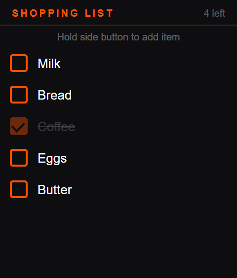
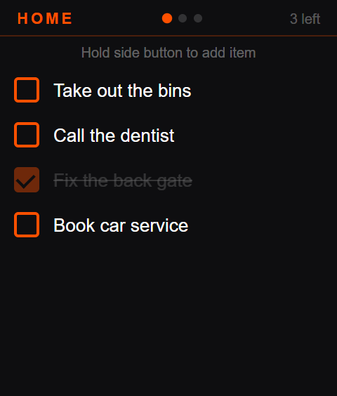
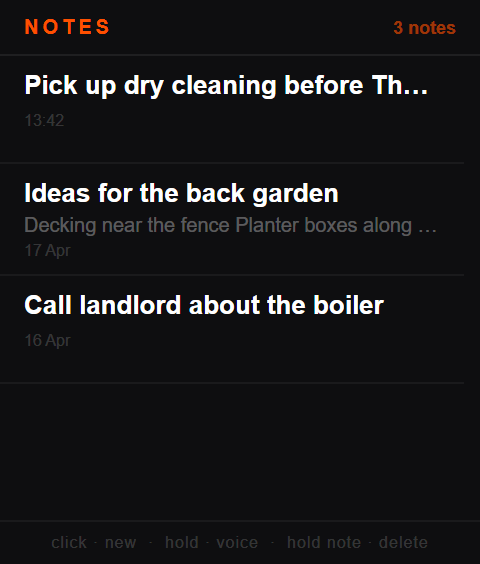
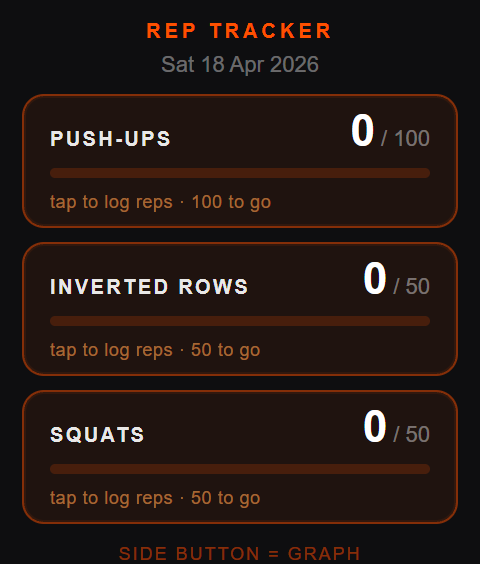
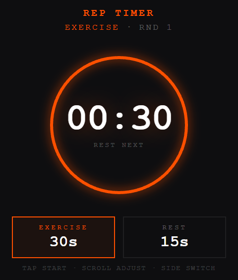
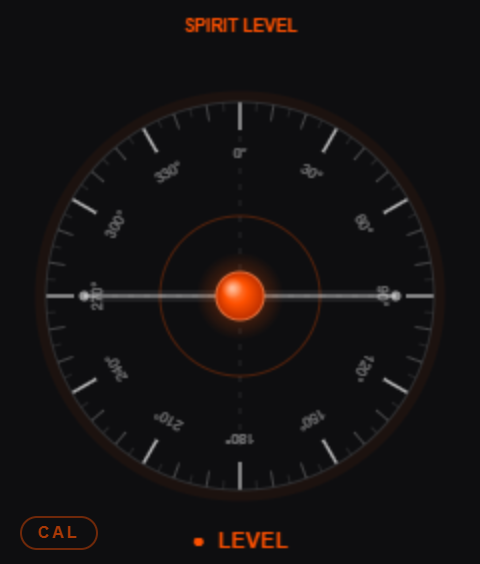
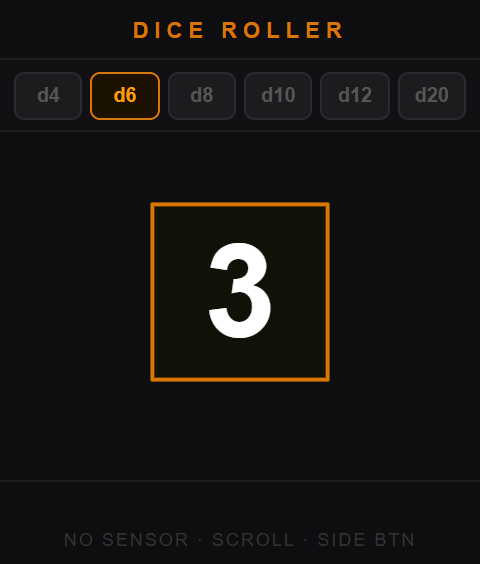
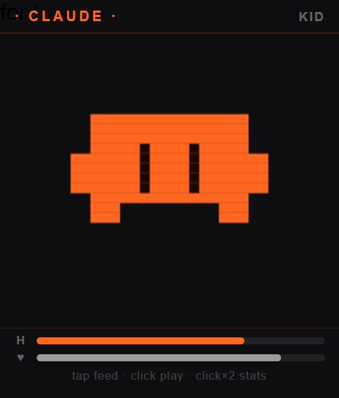
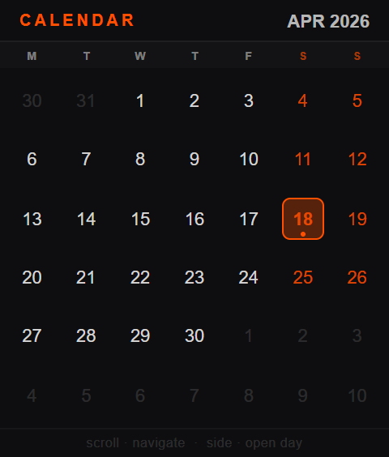

# Rabbit R1 Creations

A collection of custom creations for the Rabbit R1, built from scratch using the native R1 SDK. Voice input, accelerometer, scroll wheel, keyboard editing — all working.

## Getting started

There are three ways to use these apps:

**1. Just scan and go** — the apps are already hosted. Click any Install QR link in the table below, open the page on your computer or phone, and scan the QR code with your R1. Nothing to set up.

**2. Self-host** — clone this repo and host the apps yourself on Netlify, GitHub Pages, or any web server. Use the [setup prompt](SETUP_PROMPT.md) to get an AI assistant to walk you through it.

**3. Gemma Chat (advanced)** — AI chat that requires you to run your own backend. Clone the repo and see the [Bring your own backend](#bring-your-own-backend) section below.

Also includes a [tips & tricks doc](R1_CREATION_TIPS.md) — a running log of everything figured out building these apps.

---

## Apps

| App | Install | Description | Controls |
|---|---|---|---|
| 🛒 **shopping-list** | [Install QR](https://andr3w-hilton.github.io/rabbit-r1-creations-public/shopping-list/install.html) | Voice-powered shopping list | Hold = voice add · Long press item = delete · Double tap item = edit · Scroll = navigate |
| ✅ **todo** | [Install QR](https://andr3w-hilton.github.io/rabbit-r1-creations-public/todo/install.html) | Three lists (Home / AI Dev / Random) | Side click = cycle lists · Hold = voice add · Double tap = edit · Long press = delete · Scroll = navigate |
| 💪 **rep-tracker** | [Install QR](https://andr3w-hilton.github.io/rabbit-r1-creations-public/rep-tracker/install.html) | Daily push-up and row tracker with progress graphs | Side click = cycle exercises · Scroll up/down = log reps · Long press = reset today |
| ⏱️ **rep-timer** | [Install QR](https://andr3w-hilton.github.io/rabbit-r1-creations-public/rep-timer/install.html) | Workout interval timer | Tap = start/pause · Hold = reset · Scroll = adjust duration · Side click = switch exercise/rest |
| 🫧 **spirit-level** | [Install QR](https://andr3w-hilton.github.io/rabbit-r1-creations-public/spirit-level/install.html) | Bubble level using the native 60Hz accelerometer | Side click = calibrate · Long press = reset calibration |
| 🎲 **dice-roller** | [Install QR](https://andr3w-hilton.github.io/rabbit-r1-creations-public/dice-roller/install.html) | Shake to roll — d4 through d20, single or double dice | Shake = roll · Scroll = change die · Side click = toggle single/double dice |
| 📝 **notes** | [Install QR](https://andr3w-hilton.github.io/rabbit-r1-creations-public/notes/install.html) | Voice or keyboard notes, review before saving, QR export | Side click = new note · Hold = voice note · Double tap = edit · Long press = delete · QR button = export note |
| 📅 **calendar** | [Install QR](https://andr3w-hilton.github.io/rabbit-r1-creations-public/calendar/install.html) | Monthly calendar with daily entries — voice or keyboard input | Scroll = navigate days · Side click = open day · Scroll in day = select entry · Side click = add/edit · Hold = back |
| 🐣 **r1-buddy** | [Install QR](https://andr3w-hilton.github.io/rabbit-r1-creations-public/r1-buddy/install.html) | Tamagotchi-style pixel-art companion with catch & fishing mini-games | Tap = feed · Scroll ↑ = treat · Scroll ↓ = cuddle · Side = play · Side×2 = stats · Hold = menu (games / reset) · Shake = excite |
| 🤖 **gemma-chat** | — requires own backend | AI chat powered by Gemma 4 | Hold = speak · Side click = new chat · Scroll = navigate · Tap mute pill = mute TTS |

---

## Screenshots

<table>
  <tr>
    <td align="center"><br/><sub>Shopping List</sub></td>
    <td align="center"><br/><sub>Todo</sub></td>
    <td align="center"><br/><sub>Notes</sub></td>
  </tr>
  <tr>
    <td align="center"><br/><sub>Rep Tracker</sub></td>
    <td align="center"><br/><sub>Rep Timer</sub></td>
    <td align="center"><br/><sub>Spirit Level</sub></td>
  </tr>
  <tr>
    <td align="center"><br/><sub>Dice Roller</sub></td>
    <td align="center"><br/><sub>R1 Buddy</sub></td>
    <td align="center"><br/><sub>Calendar</sub></td>
  </tr>
</table>

---

## Bring your own backend

| App | Description | Controls |
|---|---|---|
| 🤖 **gemma-chat** | AI chat — clone the repo and run your own backend | Hold = speak · Side click = new chat · Scroll = navigate · Tap mute pill = mute TTS |

gemma-chat is not hosted here — it requires a backend server to proxy requests to an LLM. Clone the repo and follow the setup in `gemma-chat/web-server.py`. You can use any Google AI Studio key with Gemma, or swap in any OpenAI-compatible endpoint.

---

## How to self-host

The apps are already hosted and ready to use via the Install QR links above. But if you want to run your own copy — to modify the apps, pin a specific version, or just not depend on someone else's hosting — here's how.

### 1. Host the app

Pick any free static host:

- **Netlify** — drag and drop the app folder at [netlify.com](https://netlify.com). Done.
- **GitHub Pages** — push to a repo and enable Pages in settings.
- **Any web server** — the apps are plain HTML, no build step needed.

Each app is self-contained in its own folder. Host as many or as few as you like.

### 2. Update the install URL

Open the app's `install.html` and replace the existing URL with your own hosted URL:

```javascript
var creationUrl = 'https://your-domain.com/shopping-list/';
```

### 3. Generate the install QR

Open `install.html` in a browser — it generates the QR automatically from the URL above.

### 4. Scan with your R1

Open the R1 camera, scan the QR, and install. That's it.

---

## Cache busting

The R1 caches the install URL. If you update an app and want users to get the new version, bump the `?v=` parameter in `install.html`:

```javascript
var creationUrl = 'https://your-domain.com/shopping-list/?v=2';
```

Regenerate the QR and rescan.

---

## Tips & Tricks

See [R1_CREATION_TIPS.md](R1_CREATION_TIPS.md) — a running log of everything figured out building these apps. Covers voice input, keyboard handling, accelerometer, shake detection, storage, LLM integration, and more.

---

## Community

Questions or ideas? Find us in the **#r1-creations** channel on the Rabbit Discord.
