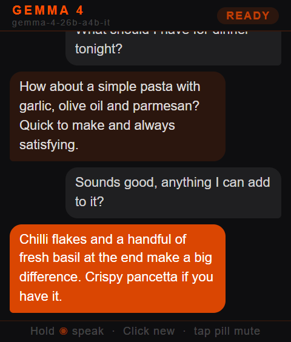

# Rabbit R1 Creations

A collection of custom creations for the Rabbit R1, built from scratch using the native R1 SDK. Voice input, accelerometer, scroll wheel, keyboard editing — all working.

Also includes a [tips & tricks doc](R1_CREATION_TIPS.md) — a running log of everything figured out building these apps, from voice input and keyboard handling to shake detection, accelerometer, storage and LLM integration.

> **New here?** Check out [SETUP_PROMPT.md](SETUP_PROMPT.md) — a prompt you can paste straight into Claude, ChatGPT, or any AI assistant and have it walk you through the entire setup process.

---

## Apps

| App | Description | Controls |
|---|---|---|
| 🛒 **shopping-list** | Voice-powered shopping list | Hold = voice add · Long press item = delete · Double tap item = edit · Scroll = navigate |
| ✅ **todo** | Three lists (Home / AI Dev / Random) | Side click = cycle lists · Hold = voice add · Double tap = edit · Long press = delete · Scroll = navigate |
| 💪 **rep-tracker** | Daily push-up and row tracker with progress graphs | Side click = cycle exercises · Scroll up/down = log reps · Long press = reset today |
| ⏱️ **rep-timer** | Workout interval timer | Tap = start/pause · Hold = reset · Scroll = adjust duration · Side click = switch exercise/rest |
| 🫧 **spirit-level** | Bubble level using the native 60Hz accelerometer | Side click = calibrate · Long press = reset calibration |
| 🎲 **dice-roller** | Shake to roll — d4 through d20, single or double dice | Shake = roll · Scroll = change die · Side click = toggle single/double dice |
| 📝 **notes** | Voice or keyboard notes, review before saving, QR export | Side click = new note · Hold = voice note · Double tap = edit · Long press = delete · QR button = export note |
| 🐣 **r1-buddy** | Tamagotchi-style pixel-art companion | Tap = feed · Side click = play · Double tap = stats · Long press = sleep |
| 🤖 **gemma-chat** | AI chat — bring your own backend/model | Hold = speak · Side click = new chat · Scroll = navigate · Tap mute pill = mute TTS |

---

## Screenshots

<table>
  <tr>
    <td align="center"><br/><sub>Shopping List</sub></td>
    <td align="center"><br/><sub>Todo</sub></td>
    <td align="center"><br/><sub>Notes</sub></td>
  </tr>
  <tr>
    <td align="center"><br/><sub>Rep Tracker</sub></td>
    <td align="center"><br/><sub>Rep Timer</sub></td>
    <td align="center"><br/><sub>Spirit Level</sub></td>
  </tr>
  <tr>
    <td align="center"><br/><sub>Dice Roller</sub></td>
    <td align="center"><br/><sub>R1 Buddy</sub></td>
    <td align="center"><br/><sub>R1 Chat</sub></td>
  </tr>
</table>

---

## How to use

These apps are **templates** — you host them yourself. Nothing is shared or tracked.

### 1. Host the app

Pick any free static host. The simplest options:

- **Netlify** — drag and drop the app folder at [netlify.com](https://netlify.com). Done.
- **GitHub Pages** — push to a repo and enable Pages in settings.
- **Any web server** — the apps are plain HTML, no build step needed.

Each app is self-contained in its own folder. Host as many or as few as you like.

### 2. Update the install URL

Open the app's `install.html` and replace `https://your-domain.com/app-name/` with the URL where you hosted the `index.html`:

```javascript
var creationUrl = 'https://your-domain.com/shopping-list/';
```

### 3. Generate a QR code

Go to [boondit.site](https://boondit.site) or any QR generator. The install page generates the QR automatically once you've updated the URL — just open `install.html` in a browser.

### 4. Scan with your R1

Open the R1 camera, scan the QR, and install. That's it.

---

## Apps that need a backend (gemma-chat)

`gemma-chat` requires a proxy server running a compatible LLM. Set your endpoint in `index.html`:

```javascript
var PROXY_URL = 'YOUR_GEMMA_PROXY_URL';
```

You can use any OpenAI-compatible endpoint, Google Gemma via AI Studio, or run your own proxy.

---

## Cache busting

The R1 caches the install URL. If you update an app and want users to get the new version, bump the `?v=` parameter in `install.html`:

```javascript
var creationUrl = 'https://your-domain.com/shopping-list/?v=2';
```

Regenerate the QR and rescan.

---

## Tips & Tricks

See [R1_CREATION_TIPS.md](R1_CREATION_TIPS.md) — a running log of everything figured out building these apps. Covers voice input, keyboard handling, accelerometer, shake detection, storage, LLM integration, and more.

---

## Community

Questions or ideas? Find us in the **#r1-creations** channel on the Rabbit Discord.
